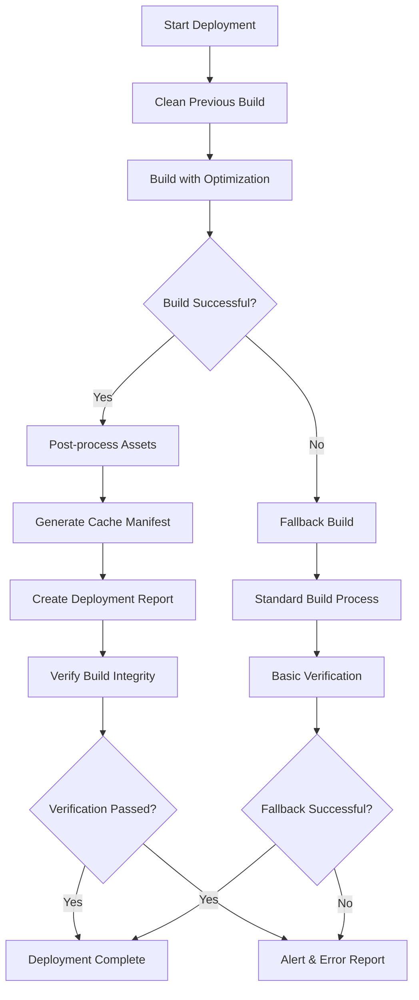

# Build Process Documentation

## Overview

This document describes the robust build system implemented for the Neff Paving project, including deployment processes, error handling, verification steps, and troubleshooting guides.

## Build System Architecture

### 1. Core Components

- **deploy-optimized.js**: Enhanced deployment script with fallback capabilities
- **verify-build.js**: Comprehensive build verification system
- **test-deployment.js**: Post-deployment testing suite
- **monitor-deployment.js**: Continuous deployment monitoring

### 2. Build Flow



## Scripts Reference

### 1. Enhanced Deployment (`deploy-optimized.js`)

**Purpose**: Primary deployment script with optimization and fallback capabilities.

**Usage**:
```bash
# Standard deployment
npm run build:optimized

# Platform-specific deployments
npm run build:optimized:vercel
npm run build:optimized:github

# Environment variables
DEPLOY_PLATFORM=vercel node scripts/deploy-optimized.js
OPTIMIZE_ASSETS=false node scripts/deploy-optimized.js
```

**Features**:
- ✅ Asset optimization (images, CSS, JS)
- ✅ Automatic fallback to standard build on failure
- ✅ Comprehensive error reporting
- ✅ Cache manifest generation
- ✅ Build verification
- ✅ Platform-specific configurations

**Configuration**:
```javascript
const config = {
  buildDir: 'dist',
  mode: 'production',
  platform: 'vercel',
  enableOptimization: true,
  enableCompression: true,
  enableCacheBusting: true
};
```

### 2. Build Verification (`verify-build.js`)

**Purpose**: Comprehensive verification of build output.

**Usage**:
```bash
# Verify default build directory
node scripts/verify-build.js

# Verify custom directory
node scripts/verify-build.js custom-dist

# As part of CI/CD
npm run test && node scripts/verify-build.js && npm run deploy
```

**Checks Performed**:
- ✅ Critical files presence and integrity
- ✅ Asset availability and sizes
- ✅ File permissions
- ✅ Manifest file validation
- ✅ Security headers configuration
- ✅ HTML structure validation
- ✅ JavaScript integrity
- ✅ Service worker detection

**Example Output**:
```
🔍 Starting comprehensive build verification...
Build directory: /project/dist

Checking build directory exists...
✓ Build directory exists
Checking critical files...
✓ Found: index.html
✓ Found: admin/index.html
✓ All critical files present and non-empty
...

📈 Verification Results:
Checks completed: 10
Checks passed: 9
Issues found: 0
Warnings: 1
```

### 3. Deployment Testing (`test-deployment.js`)

**Purpose**: End-to-end testing of deployed application.

**Usage**:
```bash
# Test local deployment
node scripts/test-deployment.js --url http://localhost:3000

# Test production deployment
node scripts/test-deployment.js --url https://neffpaving.com

# Custom configuration
node scripts/test-deployment.js --url https://staging.example.com --timeout 10000
```

**Test Categories**:
- 🌐 **Page Loading**: Homepage, admin panel, services page
- 📦 **Asset Loading**: JavaScript, CSS, fonts, images
- 🔌 **API Endpoints**: Health checks, authentication
- ⚡ **Performance**: Load times, asset sizes
- 🔒 **Security**: Headers, sensitive information exposure
- ♿ **Accessibility**: Basic accessibility compliance

**Command Line Options**:
- `--url`: Base URL to test (default: http://localhost:3000)
- `--build-dir`: Build directory to reference (default: dist)
- `--timeout`: Request timeout in milliseconds (default: 30000)

### 4. Deployment Monitoring (`monitor-deployment.js`)

**Purpose**: Continuous monitoring of deployment health.

**Usage**:
```bash
# Start monitoring with defaults
node scripts/monitor-deployment.js

# Custom configuration
node scripts/monitor-deployment.js \
  --urls https://neffpaving.com,https://www.neffpaving.com \
  --interval 60 \
  --webhook https://hooks.slack.com/services/...

# Check current status
node scripts/monitor-deployment.js --status
```

**Monitoring Checks**:
- 🏠 **Homepage functionality**
- 👑 **Admin panel accessibility**
- 🛠️ **Services page loading**
- 🔧 **API health endpoints**
- 📄 **Asset availability**
- ⏱️ **Response times**
- 🛡️ **Security headers**
- 🔐 **SSL certificate validity**

**Configuration Options**:
- `--urls`: Comma-separated list of URLs to monitor
- `--interval`: Check interval in seconds (default: 60)
- `--timeout`: Request timeout in seconds (default: 30)
- `--webhook`: Webhook URL for alerts

## Package.json Scripts

```json
{
  "scripts": {
    "build": "vite build && node scripts/copy-admin.js",
    "build:optimized": "node scripts/deploy-optimized.js",
    "build:optimized:vercel": "DEPLOY_PLATFORM=vercel node scripts/deploy-optimized.js",
    "build:optimized:github": "DEPLOY_PLATFORM=github node scripts/deploy-optimized.js",
    "verify:build": "node scripts/verify-build.js",
    "test:deployment": "node scripts/test-deployment.js",
    "monitor:deployment": "node scripts/monitor-deployment.js"
  }
}
```

## Error Handling & Recovery

### 1. Fallback Mechanism

When the optimized build fails, the system automatically:

1. **Logs the error** with full stack trace
2. **Cleans partial build** artifacts
3. **Runs standard build** without optimizations
4. **Creates fallback report** documenting the issue
5. **Continues deployment** if fallback succeeds

### 2. Error Reporting

Error reports are generated in multiple formats:

**Error Report Structure**:
```json
{
  "deployment": {
    "timestamp": "2024-01-15T10:30:00.000Z",
    "platform": "vercel",
    "status": "failed"
  },
  "errors": {
    "primary": {
      "message": "Build optimization failed",
      "stack": "...",
      "timestamp": "2024-01-15T10:29:45.000Z"
    },
    "fallback": {
      "message": "Standard build also failed",
      "stack": "...",
      "timestamp": "2024-01-15T10:30:00.000Z"
    }
  },
  "troubleshooting": {
    "suggestions": [
      "Check Node.js version compatibility",
      "Verify all dependencies are installed",
      "Check available disk space"
    ]
  }
}
```

**Report Locations**:
- `dist/error-report.json` (if dist exists)
- `last-deployment-error.json` (project root backup)

### 3. Build Verification Failures

If build verification fails:

1. **Issue Classification**: Critical vs. warnings
2. **Detailed Reporting**: Specific problems and locations
3. **Exit Codes**: Non-zero for CI/CD integration
4. **Remediation Hints**: Suggested fixes for common issues

## Deployment Pipeline Integration

### CI/CD Integration

**Example GitHub Actions**:
```yaml
name: Deploy
on:
  push:
    branches: [main]

jobs:
  deploy:
    runs-on: ubuntu-latest
    steps:
      - uses: actions/checkout@v3
      - uses: actions/setup-node@v3
        with:
          node-version: '22'
      
      - name: Install dependencies
        run: npm ci
      
      - name: Build with optimization
        run: npm run build:optimized
      
      - name: Verify build
        run: npm run verify:build
      
      - name: Test deployment
        run: npm run test:deployment --url ${{ env.STAGING_URL }}
      
      - name: Deploy to production
        run: vercel --prod
        env:
          VERCEL_TOKEN: ${{ secrets.VERCEL_TOKEN }}
      
      - name: Post-deployment tests
        run: npm run test:deployment --url ${{ env.PRODUCTION_URL }}
```

**Example Vercel Integration**:
```json
{
  "buildCommand": "npm run build:optimized",
  "outputDirectory": "dist",
  "installCommand": "npm ci",
  "env": {
    "NODE_ENV": "production",
    "DEPLOY_PLATFORM": "vercel"
  }
}
```

## Monitoring & Alerting

### 1. Continuous Monitoring

The monitoring system provides:

- **Real-time health checks** every minute
- **Automated recovery detection**
- **Performance tracking**
- **Uptime statistics**
- **Alert management**

### 2. Alert Configuration

**Webhook Alerts** (Slack, Discord, etc.):
```bash
node scripts/monitor-deployment.js \
  --webhook https://hooks.slack.com/services/YOUR/WEBHOOK/URL
```

**Alert Triggers**:
- ❌ **Failure Threshold**: 2+ consecutive failures
- 🎉 **Recovery**: Service restored after failures
- ⚠️ **Performance**: Response time > 10 seconds
- 🔒 **Security**: Missing security headers

### 3. Log Management

**Log Files**:
- `deployment-monitor.log`: Detailed check results
- `deployment-status.json`: Current system status
- `dist/deployment-report.json`: Build-specific reports

**Log Rotation**: Implement external log rotation for production use.

## Troubleshooting Guide

### Common Issues

#### 1. Build Optimization Failures

**Symptoms**:
- Build fails during asset optimization
- Large asset files causing memory issues
- Permission errors during file operations

**Solutions**:
```bash
# Disable optimization temporarily
OPTIMIZE_ASSETS=false npm run build:optimized

# Check available memory
node --max-old-space-size=8192 scripts/deploy-optimized.js

# Fix permissions
chmod -R 755 dist/
```

#### 2. Verification Failures

**Critical Files Missing**:
```bash
# Check if index.html was generated
ls -la dist/index.html

# Verify admin build
ls -la dist/admin/

# Check build logs
npm run build 2>&1 | tee build.log
```

**Asset Size Warnings**:
```bash
# Analyze bundle sizes
npm install -g bundle-analyzer
bundle-analyzer dist/

# Optimize images
npm run optimize:images
```

#### 3. Deployment Test Failures

**Connection Issues**:
```bash
# Test with increased timeout
node scripts/test-deployment.js --timeout 60000

# Test specific endpoints
curl -I https://your-site.com/api/health
```

**Asset Loading Failures**:
```bash
# Check asset paths in HTML
grep -r "assets/" dist/

# Verify asset existence
find dist/ -name "*.js" -o -name "*.css"
```

#### 4. Monitoring Alerts

**High Failure Rate**:
1. Check deployment logs
2. Verify server status
3. Test manually with curl
4. Review recent changes

**Performance Issues**:
1. Analyze response times
2. Check server resources
3. Review asset sizes
4. Consider CDN issues

### Debug Commands

```bash
# Comprehensive system check
npm run verify:build && npm run test:deployment

# Monitor with verbose logging
DEBUG=* node scripts/monitor-deployment.js

# Test specific functionality
node scripts/test-deployment.js --url http://localhost:3000

# Check build artifacts
find dist/ -type f -exec ls -lh {} \; | sort -k5 -hr
```

### Emergency Procedures

#### 1. Complete Build Failure

```bash
# Emergency fallback
npm run build  # Standard build without optimization
npm run verify:build
```

#### 2. Deployment Rollback

```bash
# Vercel rollback
vercel rollback

# GitHub Pages rollback
git revert HEAD
git push origin main
```

#### 3. Monitoring System Down

```bash
# Manual health check
curl -f https://your-site.com/ || echo "Site down"

# Quick deployment test
node scripts/test-deployment.js --url https://your-site.com
```

## Performance Optimization

### 1. Build Performance

- **Parallel Processing**: Enable multi-core asset optimization
- **Incremental Builds**: Cache unchanged assets
- **Memory Management**: Monitor Node.js heap usage

### 2. Asset Optimization

- **Image Compression**: Automatic WebP conversion
- **CSS Minification**: Remove comments and whitespace
- **JavaScript Bundling**: Tree shaking and code splitting

### 3. Monitoring Efficiency

- **Check Intervals**: Balance frequency vs. resource usage
- **Request Timeouts**: Appropriate timeouts for network conditions
- **Alert Throttling**: Prevent spam during extended outages

## Security Considerations

### 1. Build Security

- **Dependency Scanning**: Regular npm audit
- **Asset Integrity**: Subresource integrity hashes
- **Environment Isolation**: Separate build environments

### 2. Monitoring Security

- **Credential Management**: Secure webhook URLs
- **Log Sanitization**: Remove sensitive information
- **Access Controls**: Restrict monitoring endpoints

### 3. Deployment Security

- **HTTPS Enforcement**: All deployments use HTTPS
- **Security Headers**: Automatic security header injection
- **Content Validation**: Scan for exposed secrets

## Maintenance

### Regular Tasks

1. **Update Dependencies**: Monthly security updates
2. **Log Cleanup**: Weekly log rotation
3. **Performance Review**: Monthly optimization analysis
4. **Alert Testing**: Quarterly alert system verification

### Monitoring Health

```bash
# Check monitoring system status
node scripts/monitor-deployment.js --status

# Verify all scripts work
npm run verify:build
npm run test:deployment
```

### System Updates

When updating the build system:

1. **Test in staging** environment first
2. **Update documentation** with any changes
3. **Verify CI/CD integration** still works
4. **Update alert configurations** if needed

## Support & Contact

For issues with the build system:

1. **Check this documentation** first
2. **Review error logs** in detail
3. **Test with fallback builds**
4. **Contact development team** with full error reports

---

*Last updated: 2024-01-15*
*Version: 1.0.0*
