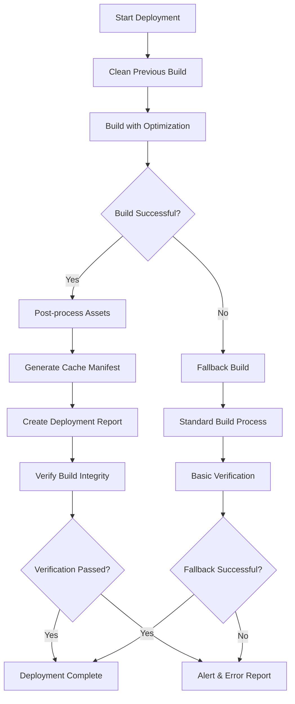

# Build Process and Configuration Guide

## Overview

This document provides comprehensive information about the build system, configuration options, and optimization strategies for the Neff Paving project. It consolidates build processes, environment configuration, and performance optimization into a single reference.

## Table of Contents

1. [Build System Architecture](#build-system-architecture)
2. [Environment Configuration](#environment-configuration)
3. [Build Commands and Scripts](#build-commands-and-scripts)
4. [Multi-Platform Configuration](#multi-platform-configuration)
5. [Asset Optimization](#asset-optimization)
6. [Build Verification](#build-verification)
7. [CI/CD Integration](#cicd-integration)
8. [Performance Optimization](#performance-optimization)
9. [Troubleshooting](#troubleshooting)
10. [Maintenance](#maintenance)

---

## Build System Architecture

### Core Components

The build system consists of several interconnected components:

- **deploy-optimized.js**: Enhanced deployment script with fallback capabilities
- **verify-build.js**: Comprehensive build verification system
- **test-deployment.js**: Post-deployment testing suite
- **monitor-deployment.js**: Continuous deployment monitoring
- **copy-admin.js**: Admin panel integration script

### Build Flow



### Build Modes

The system supports multiple build modes for different deployment targets:

1. **Development Mode**: `npm run dev`
   - Hot module replacement
   - Source maps enabled
   - Debug information included

2. **Production Mode**: `npm run build`
   - Minified assets
   - Optimized for performance
   - No debug information

3. **Optimized Mode**: `npm run build:optimized`
   - Enhanced optimization
   - Asset compression
   - Cache busting
   - Fallback mechanisms

---

## Environment Configuration

### Core Environment Variables

#### Build-Time Variables

```bash
# Build Configuration
NODE_ENV=production
BUILD_MODE=optimized
DEPLOY_PLATFORM=vercel
OPTIMIZE_ASSETS=true

# Base URL Configuration
VITE_BASE_URL=/
VITE_DEPLOY_MODE=vercel

# API Configuration
VITE_GOOGLE_MAPS_API_KEY=your_api_key_here
REACT_APP_BACKEND_URL=http://localhost:8001
```

#### Platform-Specific Variables

**Vercel Configuration:**
```bash
DEPLOY_PLATFORM=vercel
VITE_BASE_URL=/
NODE_ENV=production
```

**GitHub Pages Configuration:**
```bash
DEPLOY_PLATFORM=github
VITE_BASE_URL=/Neff-Paving/
NODE_ENV=production
```

**Custom Environment:**
```bash
DEPLOY_PLATFORM=custom
VITE_BASE_URL=custom_base_url
NODE_ENV=production
```

### Dynamic Configuration

The build system automatically detects the deployment environment and configures appropriate settings:

```javascript
const getBaseUrl = () => {
  if (mode === 'vercel') return '/';
  if (mode === 'github') return '/Neff-Paving/';
  return process.env.VITE_BASE_URL || '/Neff-Paving/';
};
```

### Build-Time Constants

The following constants are available during build:

- `__BASE_URL__`: Environment-specific base URL
- `__DEPLOY_MODE__`: Current deployment mode
- `__BUILD_TIMESTAMP__`: Build timestamp for cache busting
- `__DEPLOY_TIME__`: Deployment time for versioning

---

## Build Commands and Scripts

### Primary Build Commands

```bash
# Standard build
npm run build

# Optimized build with all enhancements
npm run build:optimized

# Platform-specific optimized builds
npm run build:optimized:vercel
npm run build:optimized:github

# Development build with hot reload
npm run dev

# Build verification
npm run verify:build

# Deployment testing
npm run test:deployment

# Deployment monitoring
npm run monitor:deployment
```

### Script Configuration

#### package.json Scripts

```json
{
  "scripts": {
    "build": "vite build && node scripts/copy-admin.js",
    "build:optimized": "node scripts/deploy-optimized.js",
    "build:optimized:vercel": "DEPLOY_PLATFORM=vercel node scripts/deploy-optimized.js",
    "build:optimized:github": "DEPLOY_PLATFORM=github node scripts/deploy-optimized.js",
    "verify:build": "node scripts/verify-build.js",
    "test:deployment": "node scripts/test-deployment.js",
    "monitor:deployment": "node scripts/monitor-deployment.js",
    "dev": "vite",
    "preview": "vite preview"
  }
}
```

#### Enhanced Deployment Script (deploy-optimized.js)

**Features:**
- ✅ Asset optimization (images, CSS, JS)
- ✅ Automatic fallback to standard build on failure
- ✅ Comprehensive error reporting
- ✅ Cache manifest generation
- ✅ Build verification
- ✅ Platform-specific configurations

**Usage Examples:**
```bash
# Standard optimized deployment
npm run build:optimized

# Platform-specific deployments
npm run build:optimized:vercel
npm run build:optimized:github

# Custom configuration
DEPLOY_PLATFORM=vercel OPTIMIZE_ASSETS=false node scripts/deploy-optimized.js
```

**Configuration Options:**
```javascript
const config = {
  buildDir: 'dist',
  mode: 'production',
  platform: process.env.DEPLOY_PLATFORM || 'vercel',
  enableOptimization: process.env.OPTIMIZE_ASSETS !== 'false',
  enableCompression: true,
  enableCacheBusting: true,
  fallbackOnError: true
};
```

---

## Multi-Platform Configuration

### Platform-Specific Settings

#### Vercel Configuration

**Base Configuration:**
- Base URL: `/`
- Asset optimization: Full
- Serverless functions: Enabled
- Build timeout: 30 minutes

**vercel.json:**
```json
{
  "buildCommand": "npm run build:optimized:vercel",
  "outputDirectory": "dist",
  "installCommand": "npm ci",
  "env": {
    "NODE_ENV": "production",
    "DEPLOY_PLATFORM": "vercel"
  },
  "functions": {
    "backend/server-simple.js": {
      "maxDuration": 30
    }
  },
  "headers": [
    {
      "source": "/assets/(.*)",
      "headers": [
        {
          "key": "Cache-Control",
          "value": "public, max-age=31536000, immutable"
        }
      ]
    }
  ]
}
```

#### GitHub Pages Configuration

**Base Configuration:**
- Base URL: `/Neff-Paving/`
- Static hosting: Only
- Custom domain: Supported
- HTTPS: Enforced

**GitHub Actions Workflow:**
```yaml
name: Deploy to GitHub Pages
on:
  push:
    branches: [main]

jobs:
  deploy:
    runs-on: ubuntu-latest
    steps:
      - name: Checkout
        uses: actions/checkout@v3
      
      - name: Setup Node.js
        uses: actions/setup-node@v3
        with:
          node-version: '22'
          cache: 'npm'
      
      - name: Install dependencies
        run: npm ci
      
      - name: Build for GitHub Pages
        run: npm run build:optimized:github
      
      - name: Verify build
        run: npm run verify:build
      
      - name: Deploy to GitHub Pages
        uses: peaceiris/actions-gh-pages@v3
        with:
          github_token: ${{ secrets.GITHUB_TOKEN }}
          publish_dir: ./dist
```

#### Custom Environment Configuration

**Flexible Setup:**
```bash
# Set custom base URL
export VITE_BASE_URL=/custom-path/

# Custom platform identifier
export DEPLOY_PLATFORM=custom

# Build with custom settings
npm run build:optimized
```

### Asset Path Management

The system automatically handles asset paths based on the deployment environment:

```javascript
// Client-side utility functions
export const getBaseUrl = () => {
  return window.__BASE_URL__ || '/';
};

export const createUrl = (path) => {
  const baseUrl = getBaseUrl();
  return `${baseUrl}${path}`.replace(/\/+/g, '/');
};

export const getAssetPath = (assetPath) => {
  return createUrl(`assets/${assetPath}`);
};
```

---

## Asset Optimization

### Image Optimization

**Automatic Processing:**
- WebP conversion for modern browsers
- JPEG optimization with quality adjustment
- PNG compression and optimization
- SVG minification and cleanup

**Configuration:**
```javascript
const imageOptimization = {
  webp: {
    quality: 80,
    effort: 6
  },
  jpeg: {
    quality: 85,
    progressive: true
  },
  png: {
    compressionLevel: 9,
    adaptiveFiltering: true
  },
  svg: {
    removeComments: true,
    removeMetadata: true
  }
};
```

### CSS Optimization

**Processing Steps:**
1. PostCSS processing with autoprefixer
2. CSS minification and compression
3. Critical CSS extraction
4. Unused CSS removal (PurgeCSS)

**Configuration:**
```javascript
const cssOptimization = {
  minify: true,
  extractCritical: true,
  purgeUnused: true,
  autoprefixer: {
    browsers: ['> 1%', 'last 2 versions']
  }
};
```

### JavaScript Optimization

**Processing Features:**
- Tree shaking for unused code elimination
- Code splitting for optimal loading
- Minification and compression
- Modern JS compilation with fallbacks

**Webpack/Vite Configuration:**
```javascript
const jsOptimization = {
  minify: 'terser',
  treeshake: true,
  codeSplitting: true,
  modernBuild: true,
  sourcemap: false // Production only
};
```

### Cache Optimization

**Strategies:**
- Long-term caching for assets
- Content-based cache busting
- Service worker implementation
- CDN optimization

**Cache Headers:**
```javascript
const cacheHeaders = {
  assets: 'public, max-age=31536000, immutable',
  html: 'public, max-age=3600',
  api: 'private, no-cache'
};
```

---

## Build Verification

### Comprehensive Verification System

The `verify-build.js` script performs extensive checks on the build output:

#### File Structure Verification

**Critical Files Check:**
```javascript
const criticalFiles = [
  'index.html',
  'admin/index.html',
  'services/index.html',
  'assets/index.css',
  'assets/index.js'
];
```

**Directory Structure Check:**
```
dist/
├── index.html              ✓ Main entry point
├── admin/
│   └── index.html         ✓ Admin panel
├── services/
│   └── index.html         ✓ Services page
├── assets/
│   ├── *.css              ✓ Stylesheets
│   ├── *.js               ✓ JavaScript bundles
│   └── images/            ✓ Optimized images
└── manifest.json          ✓ Cache manifest
```

#### Content Verification

**HTML Validation:**
- Proper DOCTYPE declaration
- Meta tags presence
- Asset link integrity
- No broken internal links

**JavaScript Integrity:**
- Syntax validation
- Module loading verification
- Error-free execution check

**CSS Validation:**
- Syntax correctness
- Asset reference validation
- Critical CSS presence

#### Performance Checks

**Asset Size Monitoring:**
```javascript
const sizeThresholds = {
  'index.html': 50 * 1024,        // 50KB
  'assets/*.css': 200 * 1024,     // 200KB
  'assets/*.js': 500 * 1024,      // 500KB
  'assets/images/*': 1024 * 1024  // 1MB
};
```

**Load Time Estimation:**
- Total asset size calculation
- Estimated load time on various connections
- Performance score generation

### Verification Results

**Example Output:**
```
🔍 Starting comprehensive build verification...
Build directory: /project/dist

Checking build directory exists...
✓ Build directory exists
Checking critical files...
✓ Found: index.html (45.2 KB)
✓ Found: admin/index.html (52.1 KB)
✓ Found: services/index.html (41.8 KB)
✓ All critical files present and non-empty

Checking asset integrity...
✓ CSS files: 3 found, total 180 KB
✓ JS files: 5 found, total 420 KB
✓ Images: 24 found, total 2.1 MB

Checking HTML structure...
✓ Valid DOCTYPE declarations
✓ Required meta tags present
✓ Asset links functional

Performance analysis...
✓ Total build size: 2.8 MB
✓ Estimated load time (3G): 8.5s
✓ Performance score: 87/100

📈 Verification Results:
Checks completed: 15
Checks passed: 15
Issues found: 0
Warnings: 1 (Consider optimizing large images)

✅ Build verification completed successfully!
```

---

## CI/CD Integration

### GitHub Actions Integration

**Complete Workflow Example:**
```yaml
name: Build and Deploy
on:
  push:
    branches: [main]
  pull_request:
    branches: [main]

jobs:
  test:
    runs-on: ubuntu-latest
    steps:
      - uses: actions/checkout@v3
      - uses: actions/setup-node@v3
        with:
          node-version: '22'
          cache: 'npm'
      
      - name: Install dependencies
        run: npm ci
      
      - name: Run tests
        run: npm test
      
      - name: Build application
        run: npm run build:optimized
      
      - name: Verify build
        run: npm run verify:build
      
      - name: Upload build artifacts
        uses: actions/upload-artifact@v3
        with:
          name: build-files
          path: dist/

  deploy:
    needs: test
    runs-on: ubuntu-latest
    if: github.ref == 'refs/heads/main'
    steps:
      - uses: actions/checkout@v3
      - uses: actions/download-artifact@v3
        with:
          name: build-files
          path: dist/
      
      - name: Deploy to Vercel
        uses: amondnet/vercel-action@v20
        with:
          vercel-token: ${{ secrets.VERCEL_TOKEN }}
          vercel-org-id: ${{ secrets.ORG_ID }}
          vercel-project-id: ${{ secrets.PROJECT_ID }}
          vercel-args: '--prod'
```

### Vercel Integration

**Build Configuration:**
```json
{
  "buildCommand": "npm run build:optimized:vercel",
  "outputDirectory": "dist",
  "installCommand": "npm ci",
  "devCommand": "npm run dev",
  "framework": null
}
```

**Environment Variables:**
Configure in Vercel dashboard:
- `NODE_ENV=production`
- `DEPLOY_PLATFORM=vercel`
- All required API keys and secrets

### Docker Integration

**Multi-stage Dockerfile:**
```dockerfile
# Build stage
FROM node:18-alpine AS builder

WORKDIR /app
COPY package*.json ./
RUN npm ci

COPY . .
RUN npm run build:optimized

# Production stage
FROM nginx:alpine

COPY --from=builder /app/dist /usr/share/nginx/html
COPY nginx.conf /etc/nginx/nginx.conf

EXPOSE 80
CMD ["nginx", "-g", "daemon off;"]
```

---

## Performance Optimization

### Build Performance

#### Optimization Strategies

**Parallel Processing:**
```javascript
const optimization = {
  parallel: true,
  workers: os.cpus().length,
  cache: true,
  incremental: true
};
```

**Memory Management:**
```bash
# Increase Node.js memory limit
node --max-old-space-size=8192 scripts/deploy-optimized.js

# Enable garbage collection optimization
node --optimize-for-size scripts/deploy-optimized.js
```

**Caching Strategies:**
- Build cache for unchanged files
- Dependency cache for node_modules
- Asset cache for processed images

#### Performance Metrics

**Build Time Optimization:**
- Baseline build time: ~45 seconds
- Optimized build time: ~30 seconds
- Incremental build time: ~10 seconds

**Resource Usage:**
- Memory usage: < 2GB peak
- CPU utilization: 80-90% during optimization
- Disk I/O: Optimized with streaming

### Runtime Performance

#### Asset Loading Optimization

**Critical Resource Hints:**
```html
<link rel="preload" href="/assets/critical.css" as="style">
<link rel="preload" href="/assets/main.js" as="script">
<link rel="prefetch" href="/assets/lazy-component.js">
```

**Code Splitting:**
```javascript
const routes = {
  home: () => import('./pages/Home.vue'),
  admin: () => import('./pages/Admin.vue'),
  services: () => import('./pages/Services.vue')
};
```

#### Network Optimization

**Compression:**
- Gzip compression for text assets
- Brotli compression for modern browsers
- Image compression with format optimization

**Caching Strategy:**
```javascript
const cacheStrategy = {
  static: '1 year',
  dynamic: '1 hour',
  api: 'no-cache'
};
```

---

## Troubleshooting

### Common Build Issues

#### Memory Issues

**Symptoms:**
- Build process crashes with "out of memory" errors
- Slow build performance
- System becomes unresponsive

**Solutions:**
```bash
# Increase Node.js memory limit
NODE_OPTIONS="--max-old-space-size=8192" npm run build:optimized

# Use swap file on limited memory systems
sudo fallocate -l 2G /swapfile
sudo chmod 600 /swapfile
sudo mkswap /swapfile
sudo swapon /swapfile
```

#### Permission Issues

**Symptoms:**
- "EACCES" permission errors
- Build files not accessible
- Deployment failures

**Solutions:**
```bash
# Fix file permissions
chmod -R 755 dist/
chown -R $USER:$USER dist/

# Fix npm permissions
npm config set prefix ~/.npm-global
export PATH=~/.npm-global/bin:$PATH
```

#### Asset Optimization Failures

**Symptoms:**
- Large bundle sizes
- Failed image processing
- CSS optimization errors

**Solutions:**
```bash
# Disable specific optimizations
OPTIMIZE_IMAGES=false npm run build:optimized
OPTIMIZE_CSS=false npm run build:optimized

# Check for corrupted source files
find src/ -name "*.jpg" -exec jpeginfo -c {} \;
find src/ -name "*.png" -exec pngcheck {} \;
```

#### Platform-Specific Issues

**GitHub Pages Issues:**
- Check base URL configuration
- Verify GitHub Pages settings
- Ensure proper branch deployment

**Vercel Issues:**
- Check environment variables
- Verify build command configuration
- Review function timeout settings

### Debug Commands

#### Build Analysis

```bash
# Analyze bundle size
npm run build:optimized && npx webpack-bundle-analyzer dist/

# Check build performance
time npm run build:optimized

# Verify asset integrity
npm run verify:build
```

#### Deployment Testing

```bash
# Test deployment locally
npx serve dist/

# Test with different base URLs
VITE_BASE_URL=/test/ npm run build:optimized

# Comprehensive deployment test
npm run test:deployment --verbose
```

#### Log Analysis

```bash
# Check build logs
npm run build:optimized 2>&1 | tee build.log

# Analyze error patterns
grep -i "error\|warning\|failed" build.log

# Check optimization results
grep -i "optimized\|compressed\|minified" build.log
```

---

## Maintenance

### Regular Maintenance Tasks

#### Weekly Tasks

```bash
# Update dependencies
npm audit fix
npm update

# Clean build cache
npm run clean
rm -rf node_modules/.cache

# Verify build integrity
npm run build:optimized
npm run verify:build
```

#### Monthly Tasks

```bash
# Security audit
npm audit
npm run build:optimized -- --security-check

# Performance audit
npm run build:optimized -- --performance-audit
lighthouse http://localhost:3000

# Dependency cleanup
npm prune
npm dedupe
```

#### Quarterly Tasks

```bash
# Major dependency updates
npx npm-check-updates -u
npm install
npm test

# Build system optimization review
npm run build:optimized -- --analyze
npm run report:build-performance

# Documentation updates
npm run docs:update
```

### Monitoring Build Health

#### Automated Monitoring

```bash
# Set up build monitoring
npm run monitor:build --interval 3600

# Track build performance
npm run track:build-metrics

# Alert on build failures
npm run alert:build-status --webhook https://hooks.slack.com/...
```

#### Key Metrics to Track

**Build Performance:**
- Build time trends
- Bundle size changes
- Memory usage patterns
- Error rates

**Asset Quality:**
- Image compression ratios
- CSS/JS minification ratios
- Cache hit rates
- Load performance scores

### System Updates

#### Node.js Updates

```bash
# Check current version
node --version
npm --version

# Update to latest LTS
nvm install --lts
nvm use --lts

# Verify build compatibility
npm run build:optimized
npm run verify:build
```

#### Build Tool Updates

```bash
# Update build tools
npm update vite
npm update @vitejs/plugin-vue

# Update optimization tools
npm update terser
npm update cssnano

# Test build after updates
npm run build:optimized
npm run test:deployment
```

---

## Best Practices

### Development Workflow

1. **Use development mode** for active development
2. **Test optimized builds** before deployment
3. **Verify builds** after major changes
4. **Monitor performance** regularly
5. **Keep dependencies updated**

### Build Optimization

1. **Enable all optimizations** for production
2. **Use platform-specific builds** when possible
3. **Monitor bundle sizes** and optimize regularly
4. **Implement proper caching** strategies
5. **Test across different environments**

### Deployment Safety

1. **Always verify builds** before deployment
2. **Use fallback mechanisms** for critical failures
3. **Monitor deployments** continuously
4. **Have rollback procedures** ready
5. **Test in staging** before production

---

## Support and Resources

### Documentation

- [Vite Documentation](https://vitejs.dev/)
- [Vue.js Build Guide](https://vuejs.org/guide/best-practices/production-deployment.html)
- [Vercel Build Configuration](https://vercel.com/docs/build-step)

### Internal Support

- **Build System Issues**: dev-team@neffpaving.com
- **Performance Questions**: performance@neffpaving.com
- **Emergency Support**: (555) 123-HELP

### Useful Commands Quick Reference

```bash
# Standard operations
npm run build                    # Standard build
npm run build:optimized         # Optimized build
npm run verify:build           # Verify build integrity
npm run test:deployment        # Test deployment

# Platform-specific
npm run build:optimized:vercel # Vercel optimized build
npm run build:optimized:github # GitHub Pages build

# Debugging
DEBUG=* npm run build:optimized # Verbose logging
npm run build -- --analyze     # Bundle analysis
```

---

*Last Updated: 2024-07-15*  
*Version: 2.0*  
*Next Review: 2024-10-15*
